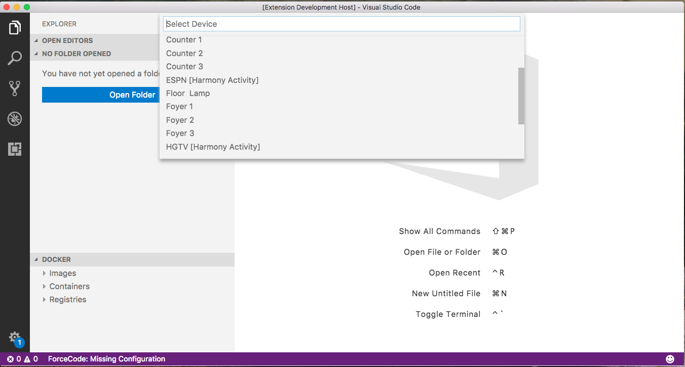

# smarthome README

VS Code extension to access Samsung Smarthings Rest API.

## Features
 - Control Shift D - brings up list of dimmable lights
 

 - Select a dimmable switch and be prompted for Brightness level 0-100%

  - Control Shift H - brings up a list of Devices that can be toggled on/off
    (If Device is a TV channel then TV/Cable Box/Stero are toggled on, switched to
    appropriate input and channel)

## Requirements

//  To activate the extension you need to install the Groovy Rest API to Smartthings 
//  and update apiEndpoint to your Rest API 
//  on https://graph.api.smartthings.com/
//  and supply a valid apiToken

